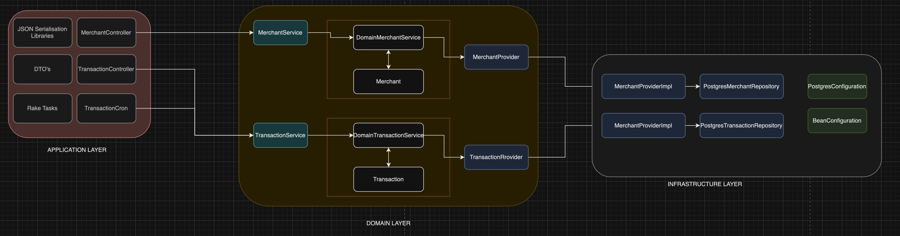
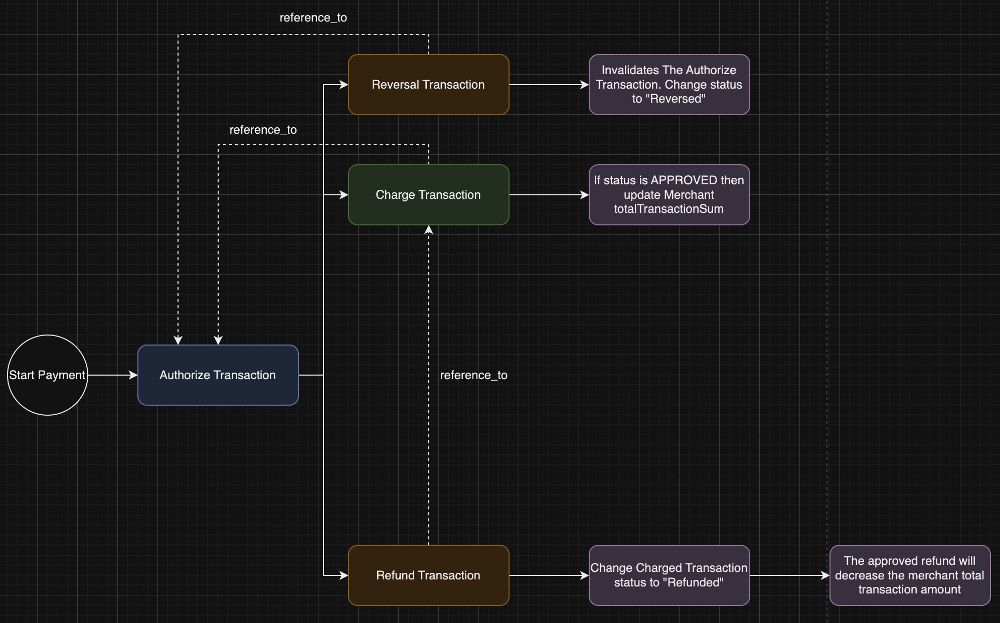
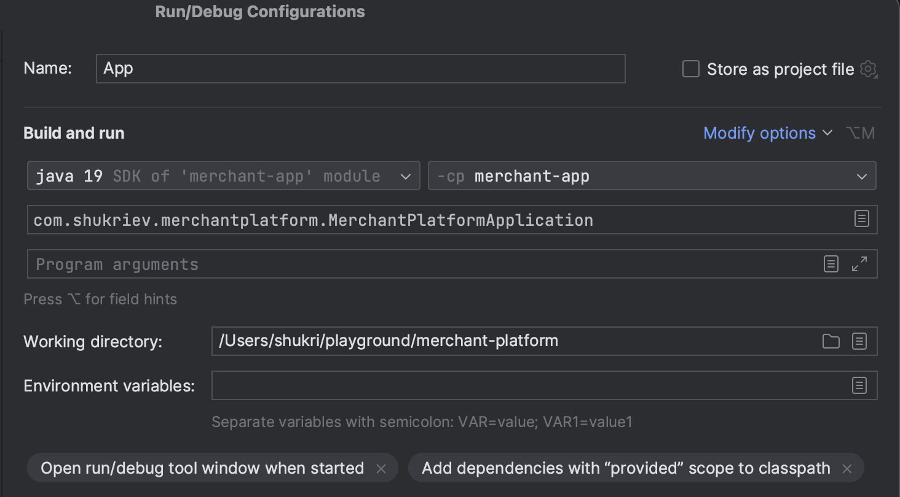
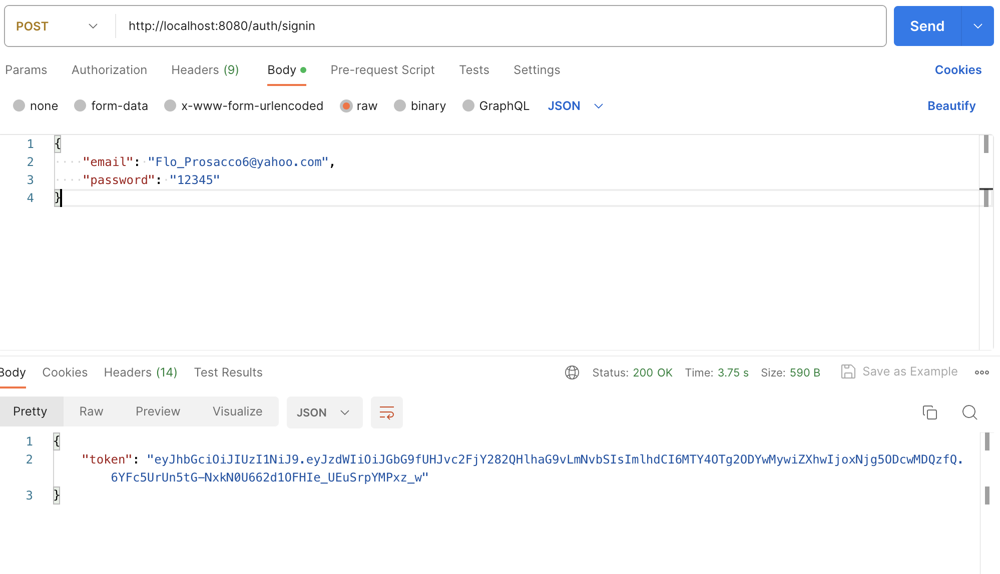

# Merchant Platform

## Merchant API
The following project is created with training and demonstration purpose.

The project demonstrates Hexagonal Architecture with Spring Boot.
The API project contains 3 modules:
1. merchant-domain - Containing the project domain model
2. merchant-infra - Contains a database ports and adapters. By using spring-data-jpa with Hibernate dialect.
3. merchant-app - Contains Spring Based REST controllers as well as a cron job

### Architecture Diagram


### Transaction Flow Diagram
This is a simple diagram demonstrating the transaction flow of the project business domain



### How To
1. Build Project: The project can be build as regular maven multi module project. Open a terminal navigate to the project root and run 
```mvn clean compile package```
2. The generated jar artifact can be run with
```java -jar merchant-platform/merchant-app/target/merchant-app-1.0-SNAPSHOT.jar```
3. If you prefer to run it in you favorite IDE. Here is an example of IntelliJ Idea run configuration

4. The application is implementing a simple rake task to populate an initial Merchant records (Application Users). 
To run the rake task a file path has to be provided as a first argument to the main method.
An example of data CSV file can be found in "/merchant-platform/merchant-app/src/test/resources/merchantData/merchantData.csv"
5. The project is implementing simple JWT authentication. An example of how to issue a new token. Btw all the users are sharing same password e.g "12345"



### Dependencies
The application setup is done with java 19. It uses Spring Boot 3 and Spring Framework 6 dependencies.
For unit and integration tests the application is using JUnit 5, TestContainers, Rest-assured.
The application is containing also a reference to JUnit 4, due to TestContainers dependency requirements.

### Notes
The application is not in a complete state
1. There are few validation TODO'S which has to be covered
2. There is pending testing work to be done. Initial testing is covering some of the base part of the application. However some more corner cases have to be added.

## Merchant UI
It's a super basic implementation of react UI. 
The purpose of the UI is to give the developer easy way of manual testing the application endpoints.

### How To
1. Build & Run: Navigate to the merchant-ui submodule. Then simply run
```npm start```

### Notes
1. The UI is not in a complete state